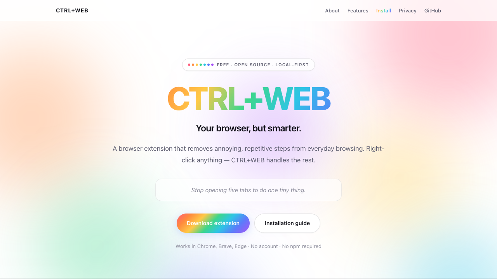
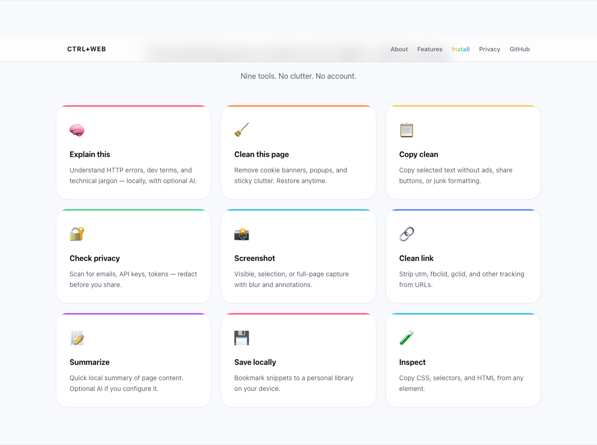
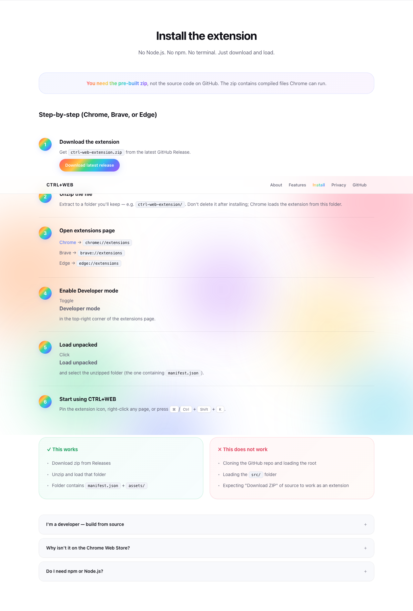

# CTRL+WEB

> **Your browser, but smarter.**

Right-click anything.  
CTRL+WEB handles the annoying part.

A local-first Chrome extension utility layer that removes repetitive steps from everyday browsing — without AI, accounts, or servers.

**Website:** https://shubhransh-gupta.github.io/ctrl-web/

## Website preview

The landing page uses a clean white layout with a seven-color gradient palette — inspired by modern SaaS product pages.

| Hero | Features | Install guide |
|------|----------|---------------|
|  |  |  |

**Live site:** [shubhransh-gupta.github.io/ctrl-web](https://shubhransh-gupta.github.io/ctrl-web/)

To regenerate screenshots after editing `website/`:

```bash
npm run screenshots
```

## Features

| Feature | Description |
|---------|-------------|
| 🧠 **Explain this** | Local knowledge base for HTTP errors & dev terms + optional AI |
| 🧹 **Clean this page** | Remove cookie banners, popups, sticky headers — fully reversible |
| 📋 **Copy clean** | Copy selected text without ads, clutter, or tracking links |
| 🔐 **Check privacy** | Detect potentially sensitive data (emails, tokens, keys) locally |
| 📸 **Screenshot** | Visible, selection, or full-page capture with annotation editor |
| 🔗 **Clean link** | Strip utm, fbclid, gclid, and other tracking parameters |
| 📝 **Summarize** | Local structural summarization + optional AI (with consent) |
| 💾 **Save locally** | Personal library stored in IndexedDB — no account needed |
| 🧪 **Inspect** | Developer overlay with CSS, selector, XPath copy actions |

## Privacy

> **CTRL+WEB is local-first. Most functionality runs entirely inside your browser.**

- No account required
- No browsing history uploaded
- No analytics by default
- No tracking by default
- No mandatory API keys
- AI features disabled by default

Your browsing data stays on your device.

## Install in Chrome / Brave / Edge

### Option A — Download pre-built (no npm required)

**End users do not need Node.js or npm.** The extension must be installed from a **built** package, not the raw TypeScript source.

1. Go to [GitHub Releases](https://github.com/shubhransh-gupta/ctrl-web/releases)
2. Download **`ctrl-web-extension.zip`** from the latest release
3. Unzip it to a folder (e.g. `ctrl-web-extension/`)
4. Open `chrome://extensions` (or `brave://extensions`)
5. Enable **Developer mode**
6. Click **Load unpacked**
7. Select the unzipped folder

That folder is the compiled extension — it works immediately, no build step.

> **Important:** Cloning the repo and loading the project root **will not work**. Chrome needs the compiled output inside `dist/` (icons, bundled JS, processed manifest). Releases provide that for you.

### Option B — Build from source (developers)

```bash
git clone https://github.com/shubhransh-gupta/ctrl-web.git
cd ctrl-web
npm install
npm run build
```

Then load the **`dist/`** folder in `chrome://extensions` → Load unpacked.

Or create a zip locally:

```bash
chmod +x scripts/package-extension.sh
./scripts/package-extension.sh
```

## Development

### Install dependencies

```bash
npm install
```

### Dev server

```bash
npm run dev
```

Load the extension in Chrome:

1. Open `chrome://extensions`
2. Enable **Developer mode**
3. Click **Load unpacked**
4. Select the `dist` folder (created by `npm run dev` or `npm run build`)

### Production build

```bash
npm run build
```

The built extension is in `dist/`.

### Run tests

```bash
npm test
```

## Usage

### Right-click menu

Select text, a link, or right-click on a page → **CTRL+WEB** → choose an action.

Context menu adapts to what you've selected.

### Command palette

Press **⌘/Ctrl + Shift + K** to open the fuzzy-search command palette.

### Toolbar popup

Click the CTRL+WEB icon for quick actions on the current site.

## Architecture

```
src/
├── background/       # Service worker, context menus, message routing
├── content/          # Content script, overlays, command palette
├── popup/            # Toolbar popup (React)
├── options/          # Settings & privacy page (React)
├── features/         # Independent feature modules
│   ├── copyClean/
│   ├── cleanPage/
│   ├── privacy/
│   ├── cleanLink/
│   ├── screenshot/
│   ├── explain/
│   ├── summarize/
│   ├── saveLocal/
│   └── inspect/
└── shared/           # Types, utils, storage, constants
```

Each feature is a self-contained module that can be invoked from the context menu, command palette, or popup via a unified messaging layer.

### Tech stack

- TypeScript
- Chrome Extension Manifest V3
- React + Vite
- IndexedDB (library)
- chrome.storage (settings)

## Browser support

Works in Chromium-based browsers:

- Google Chrome
- Brave
- Microsoft Edge

## Permissions

| Permission | Why |
|------------|-----|
| `activeTab` | Access current tab when you invoke an action |
| `contextMenus` | Right-click menu integration |
| `storage` | Save settings locally |
| `clipboardWrite` | Copy cleaned text and URLs |
| `scripting` | Inject features when needed |
| `host_permissions` | Run on web pages you visit |

## Settings

Open settings via the popup ⚙ button or `chrome://extensions` → CTRL+WEB → Details → Extension options.

Configure:

- Theme (dark/light/system)
- Default copy & screenshot formats
- Privacy & local-only mode
- Optional AI provider (disabled by default)

## Landing page

The project website lives in `website/` and is deployed to GitHub Pages:

**https://shubhransh-gupta.github.io/ctrl-web/**


It includes feature overview, step-by-step install instructions, and FAQ for users who don't want to read the README.


## Contributing

Feature modules live in `src/features/`. To add a new utility:

1. Create a module in `src/features/yourFeature/`
2. Register it in `src/shared/constants/index.ts`
3. Wire it in `src/content/contentScript.ts`
4. Add tests in `tests/`

## Roadmap

- [x] Full-page screenshot stitching
- [x] Screenshot annotation tools (blur, arrow, highlight, rectangle, text)
- [x] Auto-blur sensitive text in screenshots
- [x] AI explanation provider (optional, user-configured)
- [x] AI summarization provider
- [ ] QR code generation (local)
- [ ] Convert element to React/SwiftUI/Flutter

## License

This project is licensed under the [MIT License](LICENSE).
